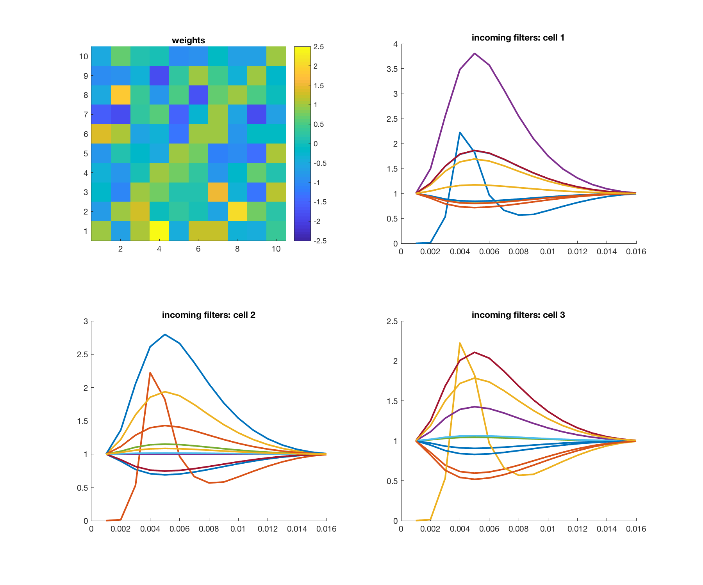
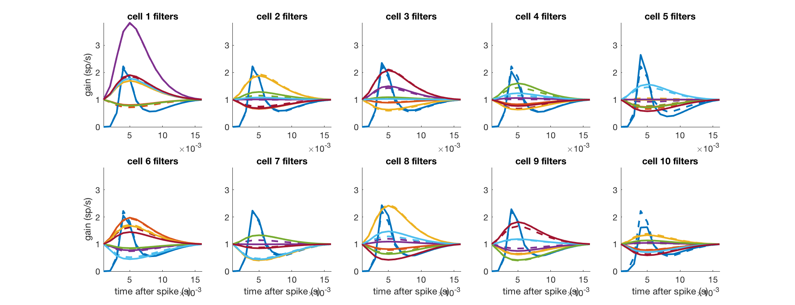

## `demo5_GLM_10CoupledNeurons.m'

A simulation with N=10 neurons.

### coupling filter basis


### Set up multi-neuron GLM "network"


### simulation using `simGLM`
parameger `gg`
```
           k: [1×1×10 double]
       nlfun: @expfun
          dc: [2.0158 2.3378 2.4208 1.9982 1.7776 2.1525 2.4173 2.0098 2.4742 1.6973]
          ih: [16×10×10 double]
         iht: [16×1 double]
      dtStim: 1.0000e-03
        dtSp: 1.0000e-03
    ihbasprs: [1×1 struct]
    ktbasprs: [1×1 struct]
```
simulation results


### Estimate results
estimated filteres `ggfit.ih`

